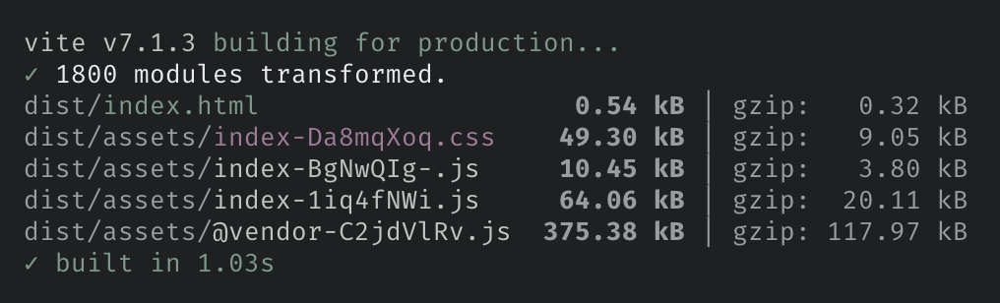
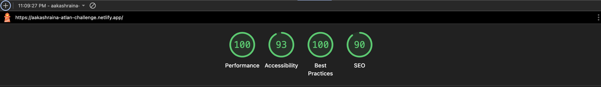

# SQL Query Tool - Atlan Frontend Challenge

## 🚀 App Overview

This SQL query tool is designed to streamline database interactions through a clean, efficient interface. Users can write SQL queries, execute them against sample datasets, view results in organized tables, and manage their query history - all within a single, unified platform.

The application focuses on providing a professional-grade query experience with features commonly found in enterprise database tools, while maintaining simplicity and ease of use.

## 🛠 Technology Stack

- **Frontend Framework:** React 18 with TypeScript
- **Build Tool:** Vite for fast development and building
- **Styling:** Tailwind CSS with custom components
- **UI Components:** Custom component library with shadcn/ui(Headless UI)
- **State Management:** Zustand for lightweight state management
- **Routing:** React Router for navigation
- **Table Management:** TanStack Table for advanced data grid functionality
- **Icons:** Lucide React for consistent iconography

## ✨ Features

### 🎯 Must-Have Features (Core Functionality)

These essential features make the app usable and functional for basic SQL query operations:

- **📝 SQL Query Editor**

  - Query execution against mock data

- **🗄️ Database & Table Exploration**

  - **Database selection** from available data sources
  - **Table browsing** with complete table listings
  - **Schema viewing** with column names and data types
  - Interactive table exploration for better query planning

- **📊 Data Table Display**

  - **Responsive table layout** with proper formatting
  - Automatic data type detection and display
  - Support for various data formats (text, numbers, dates)

- **🔄 Query History Management**

  - Automatic saving of executed queries as **recent queries**
  - Recent queries sidebar for quick access
  - Query deletion and management

- **🏠 Navigation & Layout**

  - Clean, intuitive interface design
  - Responsive layout for different screen sizes
  - Organized sidebar for navigation

### 🌟 Good-to-Have Features (Enhanced User Experience)

These features elevate the user experience and provide professional-grade functionality:

- **📌 Sticky Table Headers & Footers**

  - Headers remain visible while scrolling through data
  - Pagination controls always accessible

- **📱 Mobile-Responsive Design**

  - Collapsible sidebar for mobile devices
  - Optimized layouts for tablets and phones

- **💾 Save queries**

  - Save frequently used queries
  - Search through saved queries
  - Edit & delete saved queries

- **📤 Data Export**
  - **Export query** results to csv

## 📖 Usage Guide

### Exploring Database Structure

1. Select your desired database from the data source dropdown
2. Browse available tables in the sidebar
3. Click on any table to view its schema and column data types
4. Use this information to write informed SQL queries

### Writing Queries

1. Navigate to the main editor interface
2. Write your SQL query in the editor
3. Click "Execute" to run the query
4. View results in the data table below

### Managing Query History

- Recent queries automatically appear in the left sidebar
- Click any recent query to reload it in the editor
- Delete unwanted queries using the trash icon

### Viewing Results

- Results display in a paginated table format
- Use pagination controls to navigate through large datasets
- Column headers remain visible while scrolling
- Export results using the export button

### Responsive Features

- On mobile devices, use the hamburger menu to access the sidebar
- Tables automatically adapt to screen size
- Touch-friendly controls for mobile interaction

## ⚡ Performance Optimizations

### 🎨 Lightweight UI Architecture

- Chose shadcn/ui built on Headless UI concepts for minimal CSS
- Tailwind CSS: Only 8KB gzipped with unused styles purged

### 📦 Bundle Optimization

- Standard optimizations: minification, tree shaking, gzipping
- Application code: ~20KB optimized bundle
- Separate vendor bundle for React, Router, Lucide (to take advantage of browser caching)

### 💡 Code-Level Performance

- Lazy loading implemented for improved initial load times
- React.useMemo used to avoid unnecessary re-renders
- Efficient state management with Zustand

### 📊 Performance Measurement & Scalability

- Performance is judged via lighthouse scores by running lighthouse audit
- Pagination implemented for table data; huge lists can be easily rendered via List Virtualization(skipped for brevity)

